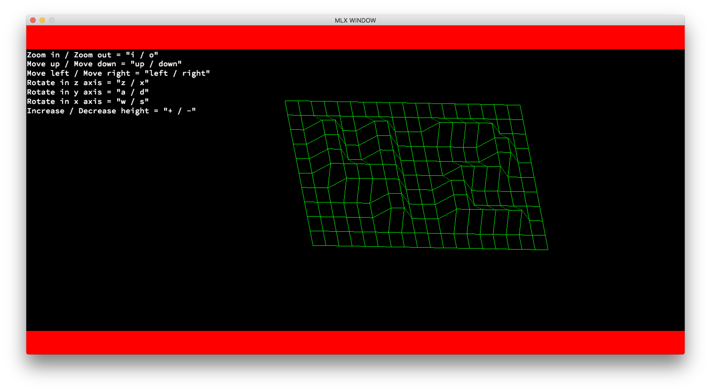

# FDF
FDF is the first project in the graphics branch at 42 School Silicon Valley. In this project I needed to create a three dimensional graphical representation of a map given in the following format:
```
0  0  0  0  0  0  0  0  0  0  0  0  0  0  0  0  0  0  0
0  0  0  0  0  0  0  0  0  0  0  0  0  0  0  0  0  0  0
0  0 10 10  0  0 10 10  0  0  0 10 10 10 10 10  0  0  0
0  0 10 10  0  0 10 10  0  0  0  0  0  0  0 10 10  0  0
0  0 10 10  0  0 10 10  0  0  0  0  0  0  0 10 10  0  0
0  0 10 10 10 10 10 10  0  0  0  0 10 10 10 10  0  0  0
0  0  0 10 10 10 10 10  0  0  0 10 10  0  0  0  0  0  0
0  0  0  0  0  0 10 10  0  0  0 10 10  0  0  0  0  0  0
0  0  0  0  0  0 10 10  0  0  0 10 10 10 10 10 10  0  0
0  0  0  0  0  0  0  0  0  0  0  0  0  0  0  0  0  0  0
0  0  0  0  0  0  0  0  0  0  0  0  0  0  0  0  0  0  0
``` 
In which the position of the numbers give the 'x' and 'y' coordinate while the numbr itself represent the 'z' coordinate. There are several bonus which added to the problem. In my case I did the rotation of the figure in all the axes, the instructions printed in the screen, the borders, the zoom in and out and the posibility to change the height of the objects. Below is an example of the result of the previous map:


## My Approach 
My approach in this project was to separate it into 3 parts:
##### 1. Structure Creation
My first step to solve this project was to read the given file and then turn it into a structure which  had previously defined. In this structure I save each of the coordinates in a position structure which has 3 fields: x, y and z. To do this I read the file and then in each number I saved its value into z, the column counter into x and the row counter into y. After the points I initialized all the other variable sin my structure which are:
1. Origin = place where the figure will be spawned in the map.
2. Separator = space between each point once you work with pixels.
3. X, Y & Z angles = angles of rotation in each axis.
##### 2. Calculations
In this part is where all the bonuses enter, before going into the drawing part I create calculations function with which all the points are modified depending on the previously mentioned variables. The fact that I made it through my object's variables made it posible for me to recalculate the all the points when the variables are changed by the user, moving the figure in real time.
##### 3. Drawing
For the drawing section we used a predefined library in which you have a function to turn on the pixels in your screen, but you have to go one by one, so what I did was go through all the points and connected them with their adjacent ones by an iteration. After drawing all the points I add the borders and the instructions to the map. 
##### BONUS
For the bonus part I used the library key event handler which returns the key pressed and depending on the key it returned I modified the variables in the structure and simply called my do calculations function again and then the draw function and you get the new figure. 
## Prerequisites
In order to be able to use this program you must be running in a operative system which uses OpenGl as its graphics handler, because the minilibx library used in this project is the macos version.

## Installing & Running
1. Clone the repository
```
git clone https://github.com/JuanCasian/FDF.git
```
2. Go into the cloned folder and run the make command which will compile the needed files and create the *fdf* executable
```
make fdf
```
3. Run the program with any of the maps in the ./testmaps/ directory or with your own map!
```
./fdf path/to/map
Ex: ./fdf testfiles/42.fdf
```
## Author
Juan Pedro Casian - Github: [@JuanCasian](https://github.com/JuanCasian) - Email: juanpedrocasian@gmail.com
